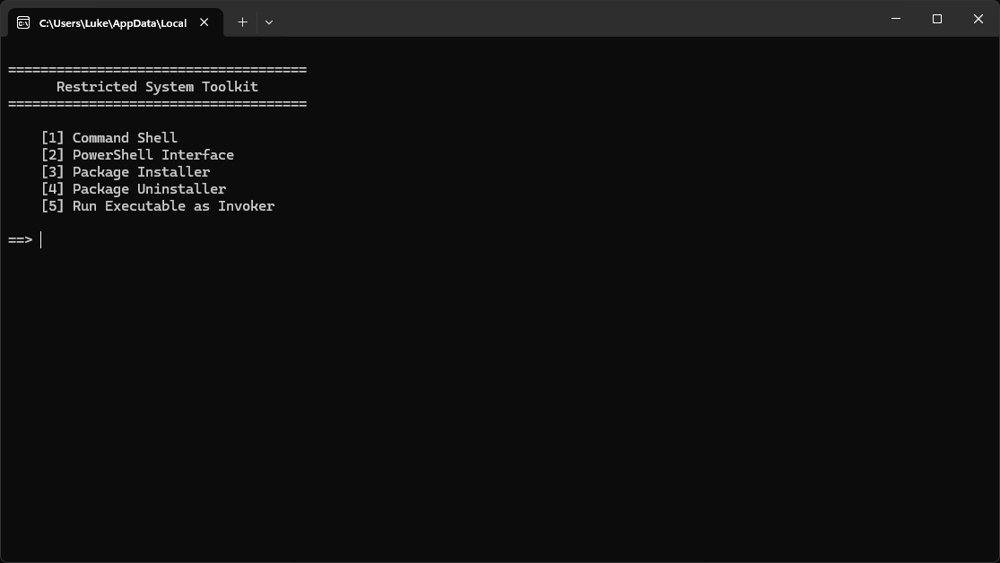

# Restricted System Toolkit

A Python-based toolkit that provides access to common command-line and system utilities on restricted Windows environments.

## About

Originally created for restricted school computers where access to Command Prompt and PowerShell was blocked. The toolkit provides lightweight interfaces for launching command-line sessions, managing Python packages, and launching Windows applications.

Originally completed in September 2025. Later polished for general use.

## Preview

